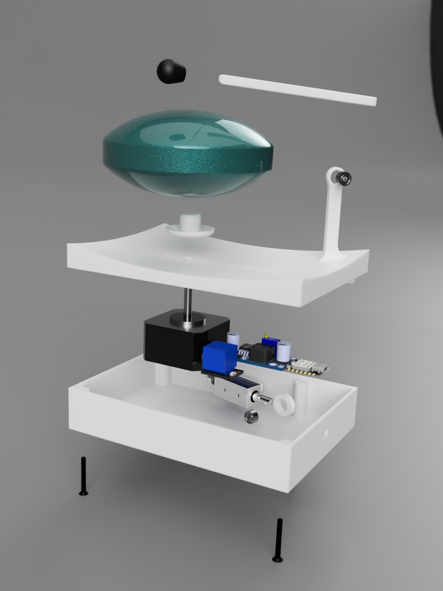
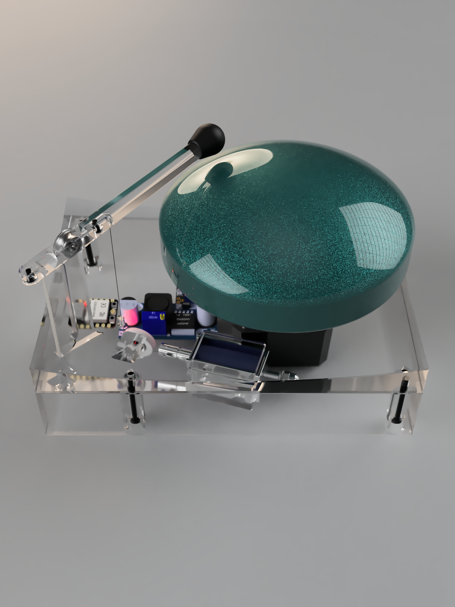

## A 'Rain Drum' playing bot

Spun by a NEMA 17 stepper motor and hit by a mallet attached to a solenoid, controlled by an ESP32-C3 microcontroller via BLE MIDI.

  
  
  

## Repo structure
- `src/RainDrum/` - Main firmware code for the ESP32-C3 microcontroller
- `parts/` - 3D models and Bill of Materials
- `assets/` - Images and videos of the project
- `src/tuning_scripts/` - Utilities to find experimental acceleration and speed values